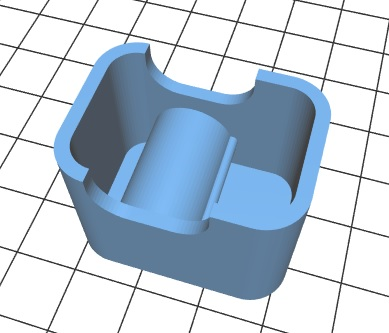

# 3D printing

I have bought [BIQU Magicain 3D at $300 on Amazon](https://www.biqu.equipment/products/biqu-magician-3d-printer-new-diy-kit-mini-kossel-delta-printing), and I have started learning 3D CAD with [freeCAD](https://www.freecadweb.org/).

### My first creation "part1"

[Movie of "BIQU Magician 3D" printing the part](./doc/3d_printing.mp4)

### Mt. Fuji

The STL data is generated by [this web site](https://maps.gsi.go.jp/#15/35.362941/138.731450/&base=std&ls=std&disp=1&vs=c1j0l0u0t0z0r0f0).

### GPS case

This is a case for [this GPS module](http://akizukidenshi.com/catalog/g/gK-09991/).

[GPS case (STL)](./gps/gps.stl)

[GPS case (SVG)](./gps/gps.svg)

### Stand

This is a stand for bluetooth headset:

[Stand (STL)](./stand/stand.stl)

[Stand (SVG)](./stand/stand.svg)

### Case for EnOcean temperature sensor

This is a case for [EnOcean temperature sensor](https://www.enocean.com/en/enocean_modules_928mhz/stm-431j/):

### Case for PCB-scope

This is a case for a very cheap oscilloscope ["PCB-scope"](http://www.picaxe.com/Hardware/Add-on-Modules/PCB-scope/):

### Case for thermisotr

This is a case for thermistor ["103AT-2"](http://akizukidenshi.com/catalog/g/gP-07258/) on this [tiny universal board](http://akizukidenshi.com/catalog/g/gP-02515/):

